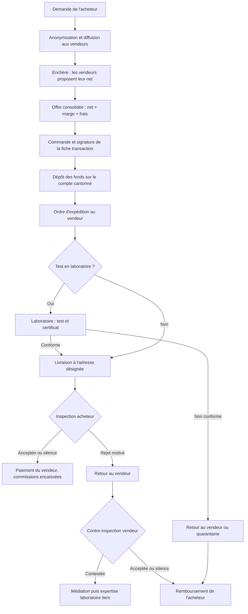

# Offre Opportunity : surplus, obsolètes et brokers, payés à l'acceptation

*Version 0.1 · 10 octobre 2026 · Document de travail, version publique. Statuts : **Décidé**, **Proposé**, **À arbitrer**.*

Cadre général : [`plateforme.md`](plateforme.md).

## 1. Synthèse

- **Ce que c'est** : l'offre de Central.Parts pour les composants issus de surplus (OEM, EMS, distributeurs) et de brokers, où l'acheteur ne paie le vendeur qu'après avoir reçu, fait tester s'il le souhaite, puis accepté les pièces. **Décidé**
- **Ce qui la distingue** : un stock contrôlé et une transaction sécurisée. Chaque lot est décrit par un questionnaire d'état qui engage le vendeur ; le paiement est conservé en euros jusqu'à l'acceptation ; des laboratoires partenaires peuvent certifier les pièces avant le paiement du vendeur ; acheteur et vendeur restent anonymes l'un pour l'autre. **Décidé**
- **Comment les prix se forment** : les demandes des acheteurs sont anonymisées et diffusées aux vendeurs, qui proposent leur prix net par enchère. Central.Parts ajoute sa marge et présente une offre consolidée. Adesio conseille le prix du vendeur. **Décidé**
- **Brokers** : toute offre de broker passe par les rails Opportunity (questionnaire et escrow), même pour une référence courante. **Décidé**

**Message** : « Ce que le canal agréé n'a plus, tracé et vérifié, payé seulement à l'acceptation. » Au discours « hors canal agréé = contrefaçon », Opportunity répond par la preuve : origine du lot, date code, conditionnement, documents, tests. **Proposé**

## 2. Cibles

- **Vendeurs** : détenteurs de surplus (OEM, EMS, CEM), y compris les excédents de programmes de stock et de consignation des distributeurs agréés ; brokers. **Décidé**
- **Acheteurs** : EMS, OEM, bureaux d'études et entrepreneurs qui cherchent des références rares, obsolètes ou en fin de vie, y compris pour des préséries. **Décidé**

## 3. Les parties

| Partie | Rôle |
|---|---|
| Acheteur | Émet la demande, dépose les fonds, inspecte ou fait inspecter, accepte ou rejette |
| Vendeur | Détient le stock ; répond aux demandes par enchère, remplit le questionnaire, expédie |
| Central.Parts | Opère la plateforme, anonymise, consolide les offres, ordonne l'expédition et le paiement, organise la médiation |
| Établissement financier | Tient le compte où les dépôts des acheteurs sont cantonnés (montage **à arbitrer**) |
| Laboratoire partenaire | Destination intermédiaire des pièces : teste, certifie, réexpédie ; son certificat conditionne le paiement du vendeur |
| Adresse de livraison tierce | Intégrateur, sous-traitant ou filiale de l'acheteur, distincte de la facturation |
| Adesio | Lecture des demandes et des stocks, matching, conseil de prix |

**Cas d'usage de référence** : un entrepreneur français veut des pièces livrées à son intégrateur chinois, testées en laboratoire en route, et 12 échantillons d'une référence en fin de vie pour une présérie. Chaque fonctionnalité doit permettre ce cas sans intervention manuelle.

## 4. Le parcours d'une transaction

| N° | Étape | Acteur | Délai par défaut (Proposé) | Si personne ne réagit |
|---|---|---|---|---|
| 1 | Demande : référence, quantité, date code minimum, emballage, exigences du questionnaire, prix cible, adresse de livraison | Acheteur | Validité 5 j ouvrés | La demande expire |
| 2 | Enchère sur la demande anonymisée | Vendeurs | 24 à 72 h selon l'urgence | Recherche étendue (frais de recherche) ou clôture |
| 3 | Offre consolidée : prix, questionnaire, photos, documents | Central.Parts | Validité 2 j ouvrés | L'offre expire |
| 4 | Commande, signature électronique de la fiche transaction | Acheteur, puis vendeur | — | — |
| 5 | Dépôt intégral des fonds | Acheteur | 4 j ouvrés | Annulation |
| 6 | Expédition avec suivi, sur ordre de Central.Parts | Vendeur | 5 j ouvrés | Annulation ; principal remboursé à l'acheteur (Décidé) |
| 7 | Test et certificat, si commandé | Laboratoire | Selon le niveau de test | Relance ; l'acheteur est informé |
| 8 | Inspection à réception | Acheteur ou son intégrateur | 10 j ouvrés | **Réputé accepté**, le vendeur est payé |
| 9 | Retour des pièces rejetées | Acheteur | Dans le délai d'inspection | — |
| 10 | Contre-inspection du retour | Vendeur | 10 j ouvrés | **Réputé accepté**, l'acheteur est remboursé |
| 11 | Médiation | Central.Parts | 15 j | Expertise d'un laboratoire tiers, qui tranche la conformité |

**Règles communes** (Proposé) :

- Délais en jours ouvrés, heure de Paris, prolongation seulement d'un commun accord.
- Chaque partie choisit ses délais dans une plage de 1 à 30 jours à la commande ; les valeurs ci-dessus sont les valeurs par défaut.
- Un minuteur visible et des relances automatiques remplacent tout décompte manuel.
- Motifs de rejet admis : contrefaçon ou soupçon de contrefaçon, non-conformité à la commande ou au questionnaire, écart de quantité, dommage de transport. Tout autre motif est refusé.
- Rejet partiel admis, ligne par ligne.

## 5. Annonces et stock

### 5.1 Import

- Formats acceptés : flux fournisseur au format Octopart et ECIA Global Standard. **Proposé**
- Champs obligatoires : référence fabricant, fabricant, quantité, date code, pays d'origine si connu, conditionnement, prix cible ou « sur demande ». **Proposé**
- Doublons : un même lot proposé par plusieurs détenteurs ou brokers est identifié et affiché une seule fois (types de stock ECIA : réel, usine, doublon). **Proposé**

### 5.2 Questionnaire d'état

Rempli par le vendeur dans l'annonce, réponse fermée et commentaire libre à chaque question. Les réponses engagent le vendeur et priment sur ses exclusions de garantie. L'acheteur peut filtrer sur chaque réponse. **Proposé**

1. Origine du stock : stock propre, acheté chez un distributeur agréé, surplus OEM/EMS, autre broker, refuse de répondre
2. Pièces déjà vendues une première fois ?
3. Retours qualité déjà subis ?
4. Neuf ou usagé
5. État visuel
6. Pièces testées ? Par qui ?
7. État fonctionnel
8. Date codes homogènes ?
9. Emballage d'origine du fabricant ?
10. Emballage d'origine ouvert ?
11. Type d'emballage : bande et bobine, plateau, tube, vrac
12. Conditions de stockage (température, humidité, sachet étanche pour les composants sensibles à l'humidité)
13. Autre problème connu ?

« Refuse de répondre » reste possible mais visible de l'acheteur.

### 5.3 Documents qualité par lot

Liste fixe, chaque document marqué « fourni » ou « absent » : photos obligatoires (étiquette, marquage, conditionnement), certificat de conformité du fabricant ou du distributeur, preuve d'achat d'origine si disponible, datasheet (lien vers le site du fabricant), rapport d'inspection. **Proposé**

### 5.4 Statuts

- Origine du stock affichée sur chaque annonce. **Proposé**
- Statut de Central.Parts affiché clairement sur cette offre : non agréé par les fabricants. **Proposé**
- Interrupteur « commande ouverte / fermée » sur la demande ; statut « vu / non vu » des offres. **Proposé**

## 6. Anonymisation et enchères

- L'identité de l'acheteur est masquée aux vendeurs, et celle du vendeur à l'acheteur. **Décidé**
- Le vendeur voit : référence, quantité, date code minimum, exigences d'emballage et de questionnaire, zone de livraison (pays ou région, jamais l'adresse), délai souhaité. **Proposé**
- Le vendeur propose son prix net ; Adesio lui indique une fourchette conseillée. **Décidé**
- Enchère inversée à offres scellées, avec indication du rang au vendeur. **Proposé**
- L'acheteur voit une offre consolidée (prix tout compris, questionnaire, photos, documents, délai), éventuellement plusieurs offres classées. **Proposé**
- **Anonymat à la livraison** : transit par un laboratoire ou un entrepôt partenaire, étiquettes neutres, ou levée de l'anonymat à l'expédition protégée par la clause de non-contournement. **À arbitrer**

## 7. Laboratoires partenaires

- Le laboratoire peut être l'adresse de livraison intermédiaire : il reçoit, teste, puis réexpédie à l'adresse désignée par l'acheteur. **Décidé**
- Son certificat de conformité précède le paiement du vendeur. **Décidé**
- Niveaux de test choisis à la commande, avec prix et délai affichés : contrôle visuel et marquage ; rayons X ; XRF ; décapsulation ; test électrique. **Proposé**
- Effet du certificat sur l'inspection de l'acheteur. **À arbitrer**
- Contrefaçon : les pièces ne sont jamais renvoyées au vendeur ; quarantaine ou destruction avec preuve ; signalement possible aux bases sectorielles. **Proposé**
- Litige sur la conformité : un second laboratoire indépendant tranche ; frais à la charge de la partie perdante. **Proposé**
- Réseau visé : 2 ou 3 laboratoires en Europe, puis un en Asie. **Proposé**

## 8. Échantillonnage

- Service payant. **Décidé**
- Échantillons prélevés dans le même lot et le même date code, avec photo du lot au prélèvement. **Proposé**
- Mini-transaction en escrow, avec option de test en laboratoire. **Proposé**
- Option d'achat du lot principal à prix fixé pendant une durée donnée (par exemple 15 jours). **Proposé**
- L'acceptation des échantillons ne vaut pas acceptation du lot principal, sauf mention contraire dans la fiche transaction. **Proposé**

## 9. Modèle économique

| Poste | Payé par | Statut |
|---|---|---|
| Commission acheteur (frais de recherche compris) | Acheteur | Décidé, taux à fixer |
| Frais d'opération (banque, change, traitement) | Acheteur | Décidé, barème à fixer |
| Commission vendeur, taux unique | Vendeur | Décidé, taux à fixer |
| Laboratoire | Acheteur, sauf conditions particulières | Proposé |
| Échantillonnage : forfait plus prix des pièces | Acheteur | Décidé, barème à fixer |
| Transport | Selon l'Incoterm de la fiche | Proposé |
| Non-expédition : remboursement du principal à l'acheteur | — | Décidé |
| Pénalité de non-expédition à la charge du vendeur | Vendeur | À arbitrer |

## 10. Cadre contractuel

| Document | Signé |
|---|---|
| Conditions générales de la plateforme | À l'inscription |
| Contrat-cadre acheteur | Une fois, après le KYB |
| Contrat-cadre vendeur | Une fois, après le KYB |
| Fiche transaction | À chaque commande, signature électronique |
| Convention laboratoire | Avec chaque laboratoire |

Principes retenus : les réponses du questionnaire font partie de la commande ; le silence dans le délai vaut acceptation (Proposé) ; remboursements uniquement vers l'IBAN autorisé au KYB (Décidé) ; non-contournement de 6 mois après chaque transaction (Décidé) ; contrats en français et en anglais, la version française fait foi (Proposé). La rédaction est confiée à un avocat ; ce document n'est pas un avis juridique.

## 11. Fonctionnalités

### 11.1 Premier lancement

- Espaces acheteur, vendeur, laboratoire et administration
- KYB à l'inscription, IBAN autorisé
- Import de stocklist (formats Octopart et ECIA), questionnaire et documents par lot
- Demande, enchère anonymisée, offre consolidée
- Fiche transaction et signature électronique
- Tableau de bord de la transaction : étape en cours, minuteur, documents, historique
- Boutons « J'accepte / Je rejette » avec justificatifs téléversés
- Notifications et relances automatiques par e-mail
- Étiquettes de retour générées par la plateforme
- Ordres de paiement et de remboursement transmis à l'établissement financier, avec double validation interne

### 11.2 Ensuite

- Échantillonnage avec option d'achat
- Connexion directe aux laboratoires (dépôt des certificats)
- Multidevise (EUR, puis USD)
- API pour les ERP des acheteurs et des vendeurs
- Diffusion du stock sur des canaux tiers, après étude de leurs conditions
